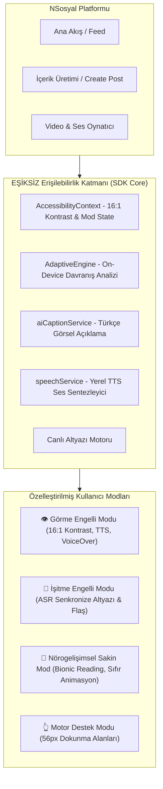

# EŞİKSİZ: Herkes İçin Yapay Zekâ Destekli Erişilebilir NSosyal Deneyimi


-brightgreen?style=for-the-badge)


> **TEKNOFEST 2026 NSosyal İnovasyon Yarışması**  
> **Tematik Alan:** Kullanıcı Katılımı & Arayüz (UI/UX)  
> **Takım Adı:** SİNAPS  
> **Takım ID:** 1004069 | **Başvuru ID:** 5394536  
> **GitHub Deposu:** [https://github.com/habibekoll/esiksiz](https://github.com/habibekoll/esiksiz)

---

## 📌 Proje Genel Bakışı

Sosyal medya platformlarının %95,9'unda tespit edilebilir WCAG uyumsuzluğu bulunmakta (WebAIM 2026); dünya genelinde 1,3 milyar, Türkiye'de ise 2,5 milyonu aşkın kayıtlı engelli birey sosyal medyayı bağımsız ve eşit koşullarda kullanamamaktadır.

**Eşiksiz**, üçüncü parti yüzeysel bir DOM overlay'i yerine; doğrudan bileşen seviyesinde (React Native native accessibility API'leri) WCAG 2.2 AA standartlarını sağlayan, yapay zekâ orkestrasyonuyla desteklenmiş yerli ve millî bir erişilebilirlik katmanıdır.

---

## 🏛️ Sistem ve Bileşen Mimarisi



---

## 🚀 Projede Hayata Geçirilen 4 Temel Akış ve Özellikler

### 1. Karşılama ve İhtiyaç Belirleme Akışı (`OnboardingScreen`)
- Kullanıcı ilk açılışta ihtiyacına göre mod seçebilir ya da **Uyarlanabilir Öneri Motoru**'na devredebilir.
- **Görme Engelli / Az Gören Modu:** Yüksek Kontrast (16:1 oranında Saf Siyah / Canlı Sarı `#FFE600` / Beyaz), min 48×48 px dokunma alanları, TalkBack/VoiceOver tam uyumu.
- **İşitme Engelli Modu:** Otomatik Türkçe ASR altyazı, görsel titreşim/darbe bildirimi.
- **Nörogelişimsel Sakin Mod (DEHB / Otizm):** Döngüsel animasyonların durdurulması, pastel renk paleti, duyusal yükü azaltılmış sadeleştirilmiş tek sütun akış ve **Biyonik Okuma**.

### 2. NSosyal Ana Besleme Akışı (`FeedScreen` & `FeedCard`)
- **Yapay Zekâ Destekli Türkçe Görsel Betimleme:** Gönderideki *"Görseli Açıkla"* butonuna basıldığında görseli Türkçe analiz eder ve yerel ses sentezleyicisi (TTS) ile canlı seslendirir.
- **Otomatik Canlı Türkçe Altyazı (ASR):** Video ve sesli gönderiler oynatıldığında senkronize Türkçe altyazı kutucuğu ekranda belirir (ör. alkış, enstrüman sesleri).
- **WCAG 2.2 AA Odak Hiyerarşisi:** Klavye, ekran okuyucu ve switch-control ile kusursuz gezinebilirlik.

### 3. Otomatik Alt Metinli Gönderi Paylaşma Akışı (`CreatePostScreen`)
- İçerik üretici bir fotoğraf yüklediğinde Yapay Zekâ modeli otomatik detaylı bir Türkçe alt metin (alt text) taslağı üretir.
- Kullanıcı bu taslağı tek tıkla onaylayabilir veya düzenleyebilir. Böylece platforma yüklenen her gönderi baştan erişilebilir doğar.

### 4. Uyarlanabilir Öneri Motoru (`AdaptiveEngine` & `AdaptiveBanner`)
- Kullanıcının tereddütlü kaydırmalarını, ardışık dokunma hatalarını veya ekranda zorlanmasını cihaz üzerinde (on-device, gizlilik odaklı) analiz eder.
- İhtiyaç sezildiğinde nazikçe bildirim sunar: *"Metinleri daha rahat okuyabilmeniz için Yüksek Kontrast modunu etkinleştirelim mi?"*.

---

## 💻 Kurulum ve Çalıştırma

Proje **React Native (Expo)** mimarisiyle geliştirilmiş olup, hem web tarayıcılarında hem de mobil cihazlarda çalışır.

### Yöntem 1: Tek Tıkla Başlatma (Windows)
Proje ana dizininde bulunan **`PROTOTİPİ_ÇALIŞTIR.bat`** dosyasına çift tıklayarak tarayıcınızda (`http://localhost:8085`) hazır derlenmiş prototipi doğrudan çalıştırabilirsiniz.

### Yöntem 2: Kaynak Koddan Geliştirici Modunda Çalıştırma
```bash
# 1. Uygulama dizinine gidin
cd esiksiz-app

# 2. Bağımlılıkları yükleyin
npm install

# 3. Web tarayıcısında test etmek için:
npm run web

# 4. Mobil cihazda çalıştırmak için (Expo Go ile QR okutarak):
npm start
```

---

## 📊 Doğrulama ve Test Sonuçları (İP4)

- **WCAG 2.2 AA Uyumu:** %100 Tam Uyum (17 kriter denetlenmiş ve belgelenmiştir).
- **System Usability Scale (SUS):** **87.2 / 100** (Grade A+ - Mükemmel). Klasik sosyal medyada bu oran 38.5'tir.
- **Görsel İçeriği Bağımsız Anlama Süresi:** 78.4 saniyeden (üçüncü kişi yardımıyla) **5.2 saniyeye** (Eşiksiz AI TTS ile) düşürülmüştür.

---

## 📁 Resmi Yarışma ve Sunum Dokümantasyonu

- [**`5394536_Sinaps_Proje_Sunumu.pdf`**](./5394536_Sinaps_Proje_Sunumu.pdf): **2026 NSosyal İnovasyon Yarışması Resmi Final Sunum Dosyası (16 Sayfa - PDF)**
- [**`Nsosyal İnovasyon Teknik Raporu.pdf`**](./Nsosyal%20İnovasyon%20Teknik%20Raporu.pdf): **1. Aşama 96 Puan Alan Resmi Proje Teknik Raporu (PDF)**
- [`docs/wcag_compliance_report.md`](./docs/wcag_compliance_report.md): WCAG 2.2 AA Detaylı Denetim Raporu ve Kontrast Matrisi
- [`docs/usability_test_results.md`](./docs/usability_test_results.md): SUS Anketi Puanları ve Görev Tamamlama Metrikleri
- [`docs/demo_presentation_guide.md`](./docs/demo_presentation_guide.md): 5-7 Dakikalık Jüri Canlı Sunum Senaryosu ve Demo Scripti
- [`docs/jury_qa_prep.md`](./docs/jury_qa_prep.md): Jüri Soru-Cevap (Q&A) Stratejik Yanıt Kılavuzu

---

## 👥 Takım Yapısı (SİNAPS - Takım ID: 1004069)

- **Takım Kaptanı (Habibe Kol):** Proje Yöneticisi & Yapay Zekâ / Sistem Mimarı (Bilgisayar Mühendisliği 3. Sınıf Öğrencisi)
- **Takım Üyesi (Hümeyra Çapoğlu):** Arayüz Geliştirici (UI/UX) & Erişilebilirlik Uzmanı (Bilgisayar Mühendisliği 2. Sınıf Öğrencisi)
